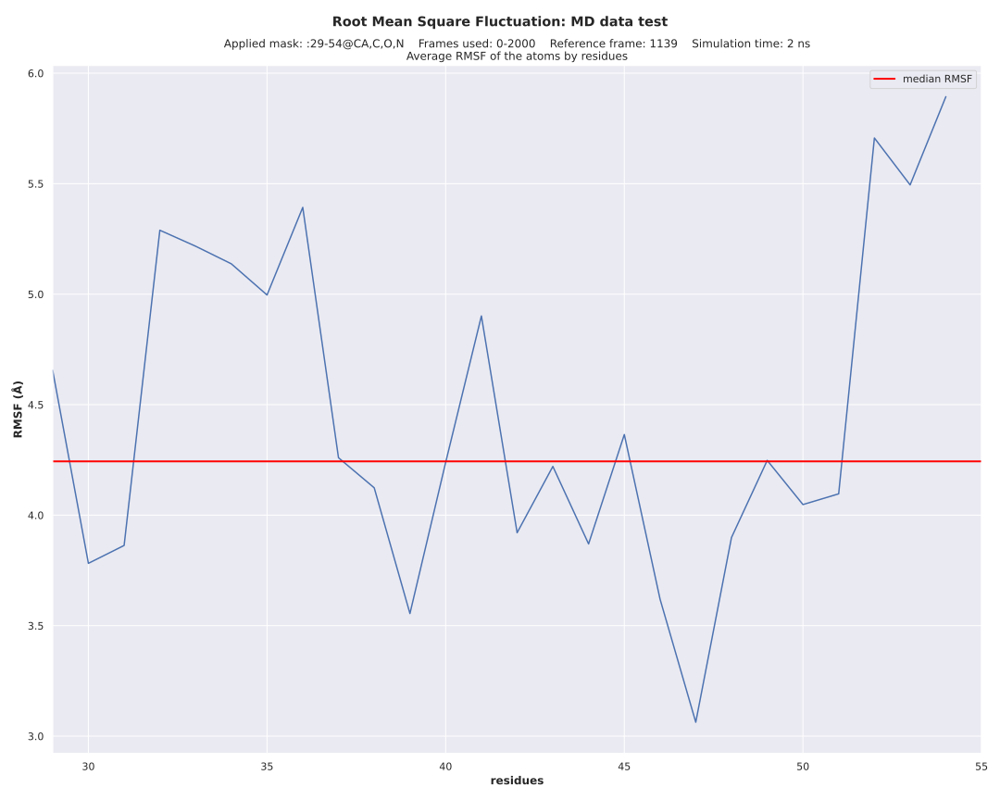

# rms

Compute the [Root Mean Square Deviation](https://amberhub.chpc.utah.edu/amber-hub/start-here-rmsd-analysis-in-cpptraj/) (RMSD) and the [Root Mean Square Factors](https://amberhub.chpc.utah.edu/atomicfluct-rmsf/) (RMSF) plots from a trajectory file.

## Conda environment

A [conda](https://docs.conda.io/projects/conda/en/latest/index.html) YAML environment file is provided: `conda_env/rms_env.yml`. The file contains all the dependencies to run the script.
The conda environment is generated using the command:
```shell script
# create the environment
conda env create -f conda_env/rms_env.yml

# activate the environment
conda activate rms
```

## Results

The usage of the script after activating the conda environment can be displayed with:

```shell script
./rms.py -h
```

The script produces a RMSD plot:


the RMSF plot without the `--domains` option:



or the RMSF plot with the `--domains` option:


and the associated CSV files.# rms
