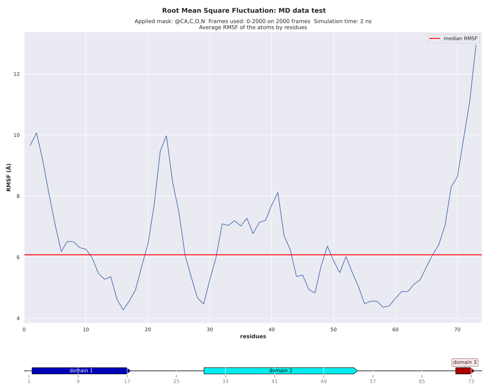
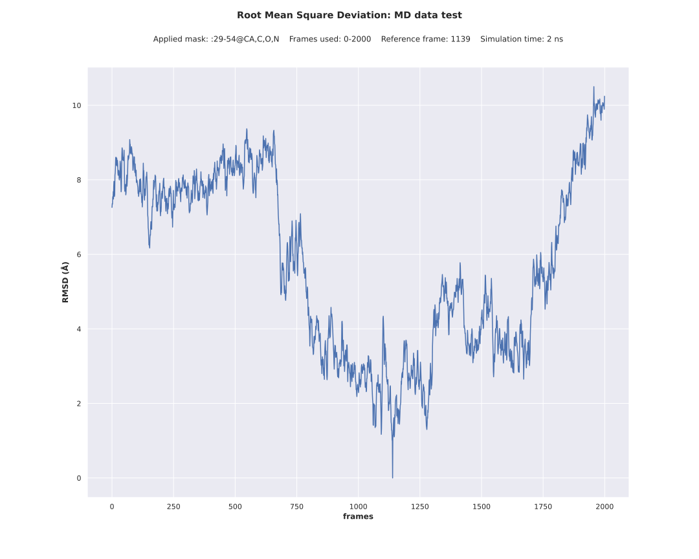
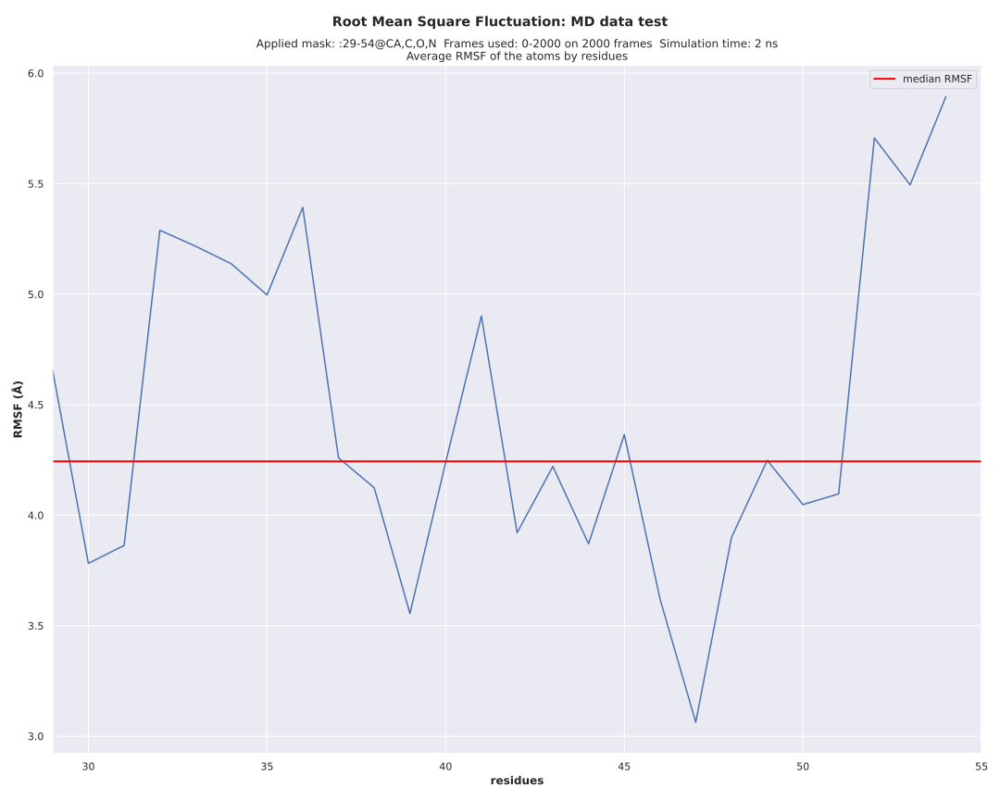

# rms

Compute the [Root Mean Square Deviation](https://amberhub.chpc.utah.edu/amber-hub/start-here-rmsd-analysis-in-cpptraj/) (RMSD) and the [Root Mean Square Fluctuation](https://amberhub.chpc.utah.edu/atomicfluct-rmsf/) (RMSF) plots from a trajectory file.

## Conda environment

A [conda](https://docs.conda.io/projects/conda/en/latest/index.html) YAML environment file is provided: `conda_env/rms_env.yml`. The file contains all the dependencies to run the script.
The conda environment is created using the command:
```shell script
# create the environment
conda env create -f conda_env/rms_env.yml

# activate the environment
conda activate rms
```

The usage of the script after activating the conda environment can be displayed with:

```shell script
./rms.py -h
```

The outputs are:
- a RMSD plot
- a RMSD data coordinates CSV file
- a RMSF plot
- a RMSF data coordinates CSV file

## RMSD and RMSF without the protein domains

The analysis can be run with the following command on the test data provided in the repository (`data_for_dev` directory):
```shell script
./rms.py --out results/MD_data_test --sample "MD data test" --info "Simulation time: 2 ns" \
--mask @CA,C,O,N --format svg --remove-pdb --topology data/MD_data_test.parm \
data/MD_data_test.nc
```

The optional arguments are:
- `--md-time` argument is the time elapsed at each frame of the molecular dynamics simulation.
- `--mask` argument is the mask to apply on the residues to compute the RMSs as described in [AMBER documentation](https://amber-md.github.io/pytraj/latest/atom_mask_selection.html#examples-atom-mask-selection-for-trajectory).

The script produces the RMSD plot:


and the RMSF plot:


## RMSD and RMSF with the protein domains

If you want to add the domains annotation of the protein, you can use the `--domains` argument which value is the path 
to a comma separated file with the domains coordinates as the one provided in `data/MD_data_test_domains.csv`. This
argument should not be used if you specify a residue selection in the mask as: `:25-57@CA,C,O,N`.

The command:
```shell script
./rms.py --out results/MD_data_test --sample "MD data test" --info "Simulation time: 2 ns" \
--mask @CA,C,O,N --format svg --remove-pdb --domains data/MD_data_test_domains.csv \
--topology data/MD_data_test.parm data/MD_data_test.nc
```

Produces the previous RMSD plot and the RMSF plot with the domains:


## RMSD and RMSF with a mask selecting residues of a domain

Plotting only the `domain 2` coordinates of the CSV domains (residue 29 to 54) file with `--mask` argument. In that case 
the `--domains` argument **should not be used**.
```shell script
./rms.py --out results/MD_data_test --sample "MD data test" --info "Simulation time: 2 ns" \
--mask :29-54@CA,C,O,N --format svg --remove-pdb --topology data/MD_data_test.parm \
data/MD_data_test.nc
```

Plot only the selected domain 2 for the RMSD and the RMSF:


